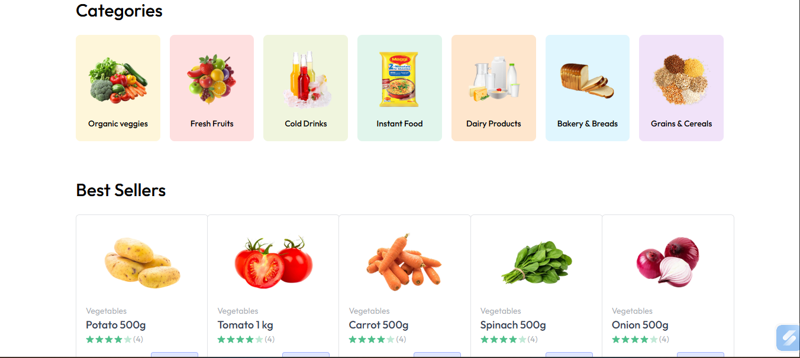
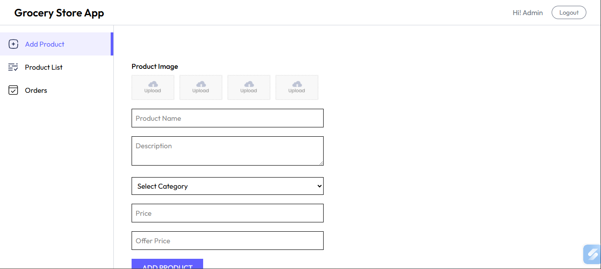

# 🌾 Farm2Home — Farmer to Consumer eCommerce Platform

Farm2Home is a MERN stack based eCommerce web application that connects farmers directly with consumers without any middlemen.

The platform helps farmers earn better profits while customers receive fresh farm products at fair prices.

---

## 🚀 Problem Statement

In traditional markets, farmers sell products to middlemen at low prices.
Consumers then buy the same products at higher prices.

Farm2Home solves this by providing a **direct digital marketplace**.

---

## ✨ Key Features

* 👨‍🌾 Farmer product listing
* 🛒 Customer product browsing
* 🔍 Category-wise filtering
* 🧾 Cart functionality
* 🔐 User authentication (JWT)
* 📦 Order management
* 📍 Address management
* 💳 Online payment integration (planned)

---

## 🧱 Tech Stack

**Frontend**

* React.js
* Tailwind CSS
* Vite

**Backend** *(In Progress)*

* Node.js
* Express.js

**Database**

* MongoDB

**Other Tools**

* Git & GitHub
* REST APIs

---

## 📁 Project Structure

```
Farm2Home/
│
├── client/          # React Frontend
│   ├── src/
│   ├── components/
│   ├── pages/
│   └── assets/
│
├── server/          # Backend (Planned)
│
└── README.md
```

---

## 📸 Screenshots

### Home Page


### Category Page


### Login Page


### All Products Page


### Seller Dashboard Page


## ⚙️ Installation & Setup

1️⃣ Clone the repository

```
git clone https://github.com/HariOmSingh47/Farm2Home.git
```

2️⃣ Go to client folder

```
cd client
```

3️⃣ Install dependencies

```
npm install
```

4️⃣ Run the project

```
npm run dev
```

---

## 🛣️ Future Scope

* Payment gateway integration
* Real-time order tracking
* Farmer analytics dashboard
* Mobile app version

---

## 👨‍💻 Developed By

**Hariom Singh**
B.Tech CSE — Final Year
Frontend Developer | MERN Stack Learner

---

⭐ If you like this project, consider giving it a star on GitHub!